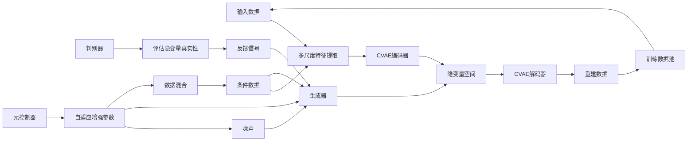
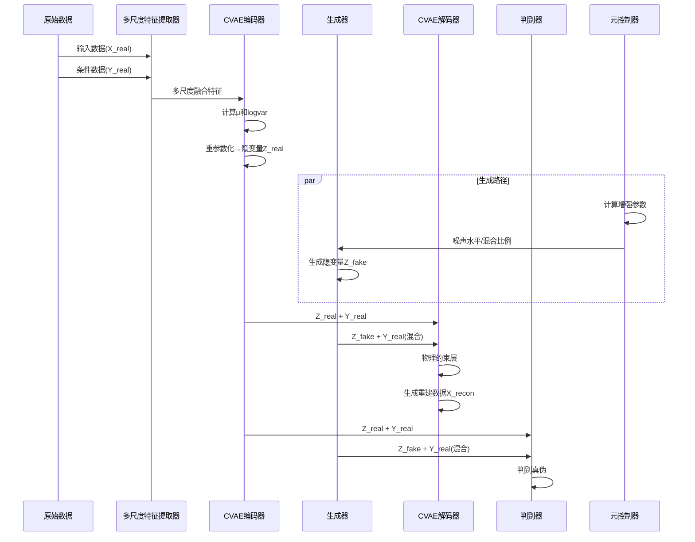
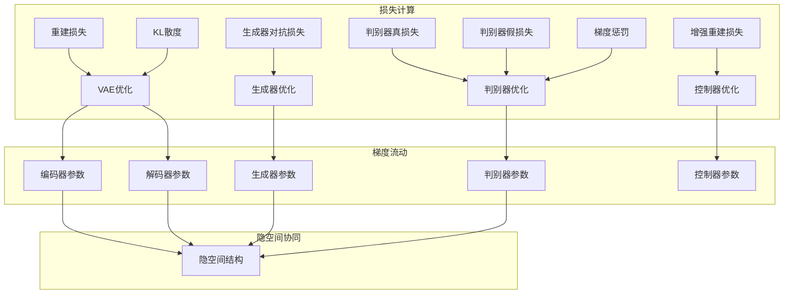
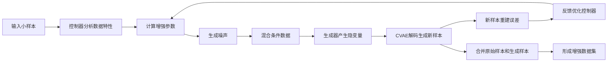

# 📊 Data_enhancement_optical
Data_enhancement for optical network.
## 关键文件说明 🔍
下面是项目里关键文件及其作用的介绍：

| 文件名 | 说明 |
| --- | --- |
| `Conditional_VAE_with_GAN_V1.py` | 包含条件变分自编码器（CVAE）与生成对抗网络（GAN）结合的实现代码，用于光学网络的数据增强。代码中定义了模型结构、训练流程、损失计算等功能。 |
| `README.md` | 当前文件，为项目提供概述和关键文件说明，帮助开发者快速了解项目。 |
| `best_model.pth` | 训练过程中保存的最佳模型权重文件，在 `Conditional_VAE_with_GAN_V1.py` 里通过 `_check_improvement` 方法保存。 |

## 模型解析 🤖
### 模型概述 📈
结合了条件VAE和GAN技术，旨在通过学习输入（x）和输出（y）之间的关系，生成新的输入样本以增强数据集。模型首先通过MultiScaleFeatureExtractor提取多尺度特征，然后使用条件VAE编码和解码数据，GAN部分通过生成器和判别器确保生成样本的真实性，MetaAugmentationController动态调整增强参数。

### 模型主体架构 🏗️
CVAE-GAN 模型由两部分组成：
1. **条件变分自编码器（CVAE）**：用于学习输入数据的潜在表示。它由编码器和解码器两部分组成，编码器将输入数据映射到潜在空间（隐空间），解码器则将潜在空间的点映射回数据空间。在训练过程中，CVAE 还通过最小化重构损失和 KL 散度（用于正则化）来学习数据的分布。
2. **生成对抗网络（GAN）**：用于生成与输入数据相似的新样本。GAN 由生成器和判别器两部分组成。生成器接收随机噪声作为输入，并尝试生成与真实数据分布相似的样本。判别器则接收真实样本和生成器生成的样本作为输入，目标是区分真假样本。在训练过程中，生成器通过对抗训练来学习生成逼真的样本，而判别器则通过最小化交叉熵损失来提高其分类能力。

### 各组件功能概要 🔍
1. **条件VAE** 编码输入x并基于输出y生成潜在空间表示，重建输入以学习条件分布。  
2. **生成器**从噪声和y生成潜在向量，试图欺骗判别器。  
3. **判别器**区分真实潜在向量（来自VAE）和假的潜在向量（来自生成器）。  
4. **元增强控制器**根据输入和输出决定增强参数，如噪声水平和混合比例。
5. **SelfAttention**提供注意力机制，允许模型关注输入的不同部分。  
6. **PhysicsInformedLayer**包含物理信息，用于指导模型生成符合物理约束的样本。  

### 核心类————AdvancedVAEcGAN类的建立与架构 🔍
AdvancedVAEcGAN类，整合了多种神经网络组件，形成一个条件生成模型。模型建立过程包括以下步骤：  配置管理：通过ConfigManager类定义模型超参数，如输入维度（12）、输出维度（5）、潜在空间维度（10）等。这些参数控制模型的规模和训练行为。  
数据预处理：DataPreprocessor类负责加载数据（如lhs_dataset_5wave_500.npz）并进行标准化，确保输入和输出数据的分布适合训练。标准化使用均值和标准差，防止除零问题。  
模型初始化：AdvancedVAEcGAN类初始化时，整合了MultiScaleFeatureExtractor、ConditionalVAE、AdvancedGenerator、SNDiscriminator和MetaAugmentationController，并设置自定义损失函数（如CustomVAELoss和CustomGANLoss）。

#### SelfAttention

- **功能**: 实现自注意力机制，允许模型关注输入的不同部分，提升特征提取能力。
- **实现**: 通过查询（query）、键（key）和值（value）计算注意力分数，使用softmax归一化后与值进行矩阵乘法，输出加权后的特征。公式为:
  $\text{Attention}(Q, K, V) = \text{softmax}\left(\frac{QK^T}{\sqrt{d_k}}\right)V$

  其中 $d_k$ 为键的维度，输出通过可学习参数 $y$ 与原始输入相加。

#### ConditionalBlock

- **功能**: 处理条件输入，结合条件信息对特征进行缩放和偏移。
- **实现**: 包含线性层、批归一化（`BatchNormId`）和`LeakyReLU`激活，条件信息通过`cond_gamma`和`cond_beta`分别控制特征的缩放和偏移。

#### PhysicsInformedLayer  
- **功能**: 引入物理约束，提升模型对特定领域知识的适应性。  
- **实现**: 基于条件 `c` 计算约束项，通过可学习参数 `y` 与输入相加，确保模型输出符合物理规律。  

#### MultiScaleFeatureExtractor  
- **功能**: 从输入 `x` 和输出 `y` 提取多尺度特征，提升模型对复杂关系的捕捉能力。  
- **实现**: 使用多个分支（对应不同尺度，如 `16`、`32`、`64`）提取特征，通过自适应平均池化（`adaptive_avg_pool1d`）进行跨尺度融合，最终通过线性层整合特征。  

#### ConditionalVAE  
- **功能**: 实现条件变分自编码器，学习 `x` 给定 `y` 的条件分布。  
- **实现**:  
  - **编码器**: 通过 `MultiScaleFeatureExtractor` 提取特征后，结合 `y` 通过线性层和自注意力层映射到潜在空间，输出均值 $\mu$ 和对数方差 $\log \sigma^2$。  
  - **重参数化**: 使用 $\mu + \epsilon \cdot \exp(0.5 \cdot \log \sigma^2)$ 采样潜在变量 `z`，其中 $\epsilon \sim \mathcal{N}(0,1)$。  
  - **解码器**: 结合 `z` 和 `y` 通过线性层重建 `x`，中间加入 `PhysicsInformedLayer` 引入物理约束。  

  - **损失函数**: 包括重建损失（MSE等）和KL散度，公式为:  
    $L_{\text{VAE}} = \text{Reconstruction Loss} + \beta \cdot \text{KL}\left(\mathcal{N}(\mu, \sigma^2) \parallel \mathcal{N}(0,1)\right)$
    其中 $\beta = 0.7$（从配置中获取）。

#### AdvancedGenerator
- **功能**: 生成条件潜在向量 `z`，试图欺骗判别器。  
- **实现**: 从噪声和条件 `y` 开始，通过多个 `ConditionalBlock` 和自注意力层逐步生成 `z`，最终通过 `Tanh` 和线性层输出。  

#### SNDiscriminator
- **功能**: 区分真实潜在向量（来自VAE）和假的潜在向量（来自生成器）。  
- **实现**: 使用谱归一化（`spectral normalization`）稳定训练，通过线性层和自注意力层处理 `z` 和 `y` 的拼接，输出一个标量表示真实概率。  
#### MetaAugmentationController  
- **功能**：动态决定数据增强参数，如噪声水平、混合比例和生成因子。  
- **实现**：通过线性层处理x和y的拼接，输出三个参数（噪声水平、混合比例、生成因子），通过sigmoid激活限制在[0,1]范围内，生成因子进一步线性变换。

### 组件协作机制 🔄
模型的训练和生成过程体现了各组件的协同工作。  
特征提取与编码：MultiScaleFeatureExtractor 首先处理输入 $x$ 和条件 $y$，提取多尺度特征，然后将其输入到 ConditionalVAE 的编码器中。编码器结合条件 $y$ 生成潜在空间的均值 $\mu$ 和对数方差 $\log\sigma^2$，通过重参数化技巧采样得到隐变量 $z$。

VAE训练：使用CustomVAELoss计算损失，包括重建损失和加权的KL散度。损失函数还包括周期性KL增强（每10个epoch增加一项），提升潜在空间的分布质量。  
优化器为Adam，学习率从配置中获取（例如2e-4），并使用梯度裁剪（max_norm=1.0）防止梯度爆炸。

GAN训练：生成器从噪声和y生成假z，判别器区分真实z（来自VAE）和假z。  
损失函数为CustomGANLoss，基于二分类交叉熵（BCE），损失函数为 CustomGANLoss，基于二分类交叉熵（BCE），并加入梯度惩罚（WGAN - GP 风格）确保 Lipschitz 连续性。公式为：
$L _ { \mathrm { G P } } = E \Bigl [ ( \| \nabla _ { \hat { \mathbf { Z } } } D ( \hat { \mathbf { Z } } ) \| _ { 2 } - 1 ) ^ { 2 } \Bigr ]$
其中 $\hat{z}$
为真实和假样本的插值。  
优化器分别为Adam（生成器1e-4，判别器4e-4），同样使用梯度裁剪。

元增强控制器训练：控制器根据x和y输出增强参数，生成新样本并计算重建损失（MSE），优化控制器以改进增强效果。  
优化器为RMSprop，学习率5e-4，同样使用梯度裁剪。

数据增强过程：generate_samples方法从噪声采样，通过生成器和VAE解码器生成新样本，条件为y，可选择策略（如“optimal”使用控制器参数）。  
adaptive_augmentation方法根据目标大小动态生成样本，使用控制器参数控制生成数量和质量，确保增强后数据集达到指定规模。

## 模型训练 🚀
### 训练过程 🚀
CVAE-GAN 模型的训练分为两阶段：
1. **预训练阶段**：在该阶段，仅训练 CVAE 模型，目标是学习数据的分布。通过最小化重构损失和 KL 散度来优化模型参数。
2. **对抗训练阶段**：在该阶段，同时训练 CVAE 和 GAN 模型。首先，固定 CVAE 的参数，仅训练 GAN 的生成器和判别器。生成器的目标是生成逼真的样本，判别器的目标是将真实样本和生成器生成的样本区分开。通过对抗训练，生成器不断提高生成逼真样本的能力，而判别器则不断提高识别真假样本的能力。在训练过程中，通过最小化生成器的对抗损失和判别器的交叉熵损失来优化模型参数。

### 训练监控 📈
使用ModelTrainer类管理训练过程，包括：  
每epoch打乱数据，按批次训练（批大小为4）。  
监控损失（如VAE损失、GAN损失），每10个epoch保存检查点。  
实现早停（patience=30），基于VAE和判别器损失的组合判断改善。  
处理NaN/Inf情况，通过减半学习率应对，防止训练崩溃。

### 数据预处理 🧹
DataPreprocessor加载数据（如Latin Hypercube Sampling数据集），标准化输入和输出，使用均值和标准差，避免除零问题。  
增强后数据通过inverse_transform恢复原始尺度，保存为.pth文件，包括标准化和原始尺度的数据。

## 模型整体流程图 💻 ————协同增强机制

### 阶段1: 前向传播与特征提取

### 阶段2: 反向传播与协同优化

### 阶段3: 自适应数据增强流程

